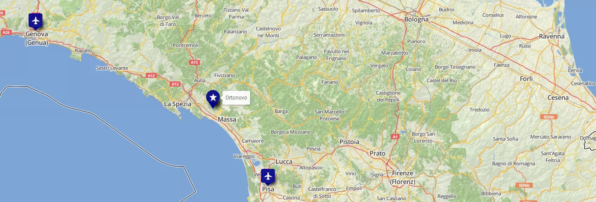

+++
title = "Reizen/Vervoer"
slug = "travel"
thumbnail = "images/tn.png"
description = ""
+++

Dit gedeelte van de website is nog in ontwikkeling...

Op 8 juni 2019 trouwen Cora en Edo! Jullie zijn van harte welkom op de ceremonie en het huwelijksfeest op deze dag in [Ortonovo](https://en.wikipedia.org/wiki/Ortonovo)!

### ✈  &ensp;Vlieghavens

* De dichtstbijzijnde vlieghaven is [Pisa vlieghaven] (https://www.pisa-airport.com/) ,
* Een andere vlieghaven "in de buurt" is [Genova vlieghaven] (https://www.genovaairport.com/) .

### 🚗 Autoverhuur
Op alle vlieghavens zijn er een aantal autoverhuurbedrijven te vinden, _bvb._:

* [RentalCars Pisa](https://www.rentalcars.com/en/airport/it/psa/?affiliateCode=msn_new_row&preflang=en&label=msn-39uoIQWB6JCk1jN0bmR29w-76003781912160&adcamp=Airports%20-%20Italy&adco=cpc&utm_medium=cpc&utm_source=bing&utm_term=39uoIQWB6JCk1jN0bmR29w&msclkid=2448ee6968a91d729680b22ddf26963c) 
* [RentalCars Genova](https://www.rentalcars.com/en/airport/ch/gva/?affiliateCode=msn_new_row&preflang=en&label=msn-pFOrQvR3ih4LFY6aMxwlFQ-75591465074382&adcamp=Airports%20-%20Switzerland&adco=cpc&utm_medium=cpc&utm_source=bing&utm_term=pFOrQvR3ih4LFY6aMxwlFQ&msclkid=d14e75a5c2921bf865d829e17544448e) 

### 🚂 Treinen
Ortonovo is binnen een kwartier met de auto te bereiken van de dichtstbijzijnde treinstations:

* _Carrara-Avenza_ 
* _Massa Centro_

Kaartjes en dienstregeling: [trenitalia] (https://www.trenitalia.com/tcom-en).

### 🚌 Bussen naar/vanuit Ortonovo

Er rijden volgende bussen tussen de treinstations en Ortonovo: [CTT Nord Massa-Carrara] (https://massacarrara.teseo.app/)

* _Carrara-Avenza_ naar Ortonovo: bussen 82 of 83 (~1/2 uur)
* _Massa Centro_ naar Ortonovo: bussen 17 and 82 (~2 uur)

[Laat ons weten a.u.b.](mailto:caviranipots@gmail.com) als je bij je aankomst/vertrek hulp nodig hebt, m.b.t. de reis van het station naar Ortonovo en terug.

### &#129309; Autodelen
1. We verwachten dat veel gasten auto's hebben om in de buurt van Ortonovo te reisen. 
2. Sommige mensen kunnen ook lift nodig hebben om van/naar de vlieghavens en de stations te reizen.
3. Daarom willen we het initiatief "Autodelen" coordineren om iedereen's reis een stuk makkelijker te maken.
  * Als je een auto met vrije plaatsen hebt,  *[laat ons weten, aub](https://docs.google.com/forms/d/e/1FAIpQLScJLmbVqMeDLjNyuYsAIG8bULhX4dJW82KQXiBOjhvQg18REA/viewform?usp=sf_link)*.
  * Als je lift nodig hebt, *[laat ons weten, aub](https://docs.google.com/forms/d/e/1FAIpQLSeNe8Y8DdOuJftMdVe_Y9ZdNUVcMvt7PFnieALL51_XCOfb5A/viewform?usp=sf_link)*.
4. We zullen de auto-hebbers en auto-nodigers in contact brengen. 

